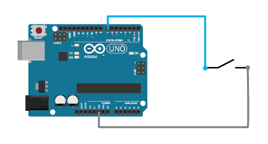
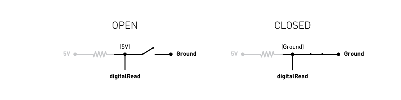
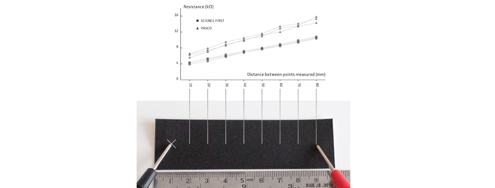
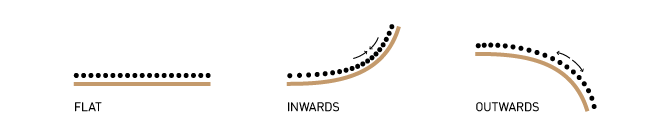
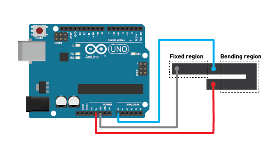
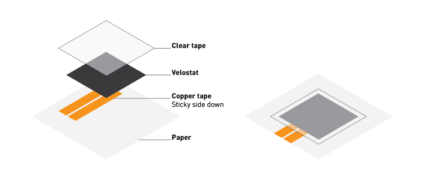
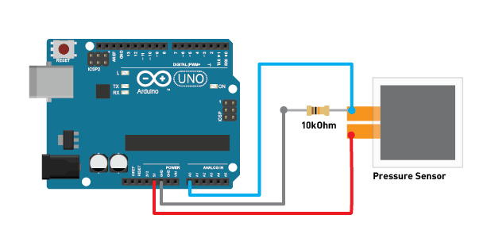
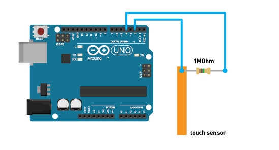

# Electronics As Material

Class materials for the Electronics As Material section in Design Fundamentals (NUS DID Year 1). 

Here, you will find information on how to build different sensors.

Or, jump to the [page for the class assignment](snake).

 
 
 

## Contents
1. [Arduinos, Inputs, Logic Levels](#logic)
1. [Button](#button)
    - [Button with pull-down resistor](#buttonPulldown)
    - [Button with internal pull-up](#buttonPullup)
1. [Bend Sensor](#bend)
1. [Pressure Sensor](#pressure)
1. [Touch Sensor](#touch)
1. [Detecting Sensor Events](#buttonEvent)

 
 
 

## <a id="logic">Microcontrollers, Inputs, Logic Levels</a>
A microcontroller (such as the Arduino Uno) is a digital electronic device that 'thinks' in binary states: 1/0, On/Off, High/Low. Each microcontroller has certain set of logic level thresholds it operates within, usually defined in terms of voltages.

| | | |
|---|---|---|
| Pinout diagram for Arduino Uno R3 | | image from Arduino.cc |
| | | |

 

This matters as it affects how read the input pins on a microcontroller. In the Arduino programming environment, this is achieved with the `digitalRead(INPUT_PIN_NUMBER)` function.

To use an (over)simplified example, the Arduino Uno R3 operates on 5V logic. When more than 2V is supplied to an input pin, the `digitalRead(INPUT_PIN_NUMBER)` reading will be `HIGH/1`. When less than 0.8V is supplied to an input pin, the `digitalRead(INPUT_PIN_NUMBER)` reading will be `LOW/0`. (See figure above)

 

Sometimes however, On and Off is not good enough for our purposes; for instance, when you want to find out the amount of force exerted on a button. In this case, we need measure an analog value; one that is between `HIGH` and `LOW`. However, remember that microcontrollers are still digital devices. To achieve a more continuous logic/voltage reading, the microcontroller converts these analog readings into digital signals through an ADC (Analog to Digital Converter). 

A microcontroller might have a number of input pins connected to ADC for you to use; such as pins `A0` to `A5` on the Arduino Uno R3. In the Arduino programming environment, you can read analog inputs with the `analogRead(INPUT_PIN_NUMBER)` function.

The ADC breaks down a logic level into smaller steps depending on its resolution (measured in bits). For instance, a 10-bit ADC breaks down a logic level to 1024 steps (2 to the power of 10). The Arduino Uno R3 provides 10-bit ADCs operating on a 5V logic level. (See figure above)

e.g. 
| input voltage | `analogRead` value |
|---|---|
| 0.0V | 0 |
| 5.0V | 1023 |
| 2.5V | 512 |

 
 

For a more detailed explanation, do refer to this [Sparkfun's article on logic levels](https://learn.sparkfun.com/tutorials/logic-levels/) and also [their article on analog to digital conversions](https://learn.sparkfun.com/tutorials/analog-to-digital-conversion/all).

 
 
 

## <a id="button">Button</a>
A button in its simplest form is an input that provides an `on` or `off` state, usually by closing or opening an electrical circuit. To read a button with a microcontroller, we need to construct a circuit connected to a digital pin that can toggle between `HIGH/1` and `LOW/0` depending on the interaction with the button.

 

### <a id="buttonPulldown">Button with pull-down resistor</a>

 

We use the diagram above to create our button circuit.

 

This circuit follows the following schematic. Essentially, when the button is open, the resistor "pulls down" the digital pin value to `Ground`, and it reads `LOW/0`. (That is why it is called a pull-down resistor.) When the button is closed, the level at the digital pin is `5V` and it reads `HIGH/1`.

Use the following [example code](code/buttonRead) to read this circuit. The digital pin used in this example is `7`.

 

### <a id="buttonPullup">Button with internal pull-up</a>

Microcontrollers like the Arduino Uno R3 also provide internal pull-up resistors for some digital pins. In this case, a button circuit can be simplified following the diagram below.

 
 

This circuit follows the following schematic. Essentially, when the button is open, an internal resistor "pulls up" the digital pin value to `5V`, and it reads `HIGH/1`. (That is why it is called a pull-up resistor, note that the readings are opposite from a button with a pull-down resistor.) When the button is closed, the level at the digital pin is `Ground` and it reads `LOW/0`.

To access the internal pull-up resistor on an Arduino Uno R3, we will use the `pinMode` command to set the type of pin to `INPUT_PULLUP`. 

e.g. `pinMode(7, INPUT_PULLUP)`.

Use the following [example code](code/buttonRead_pullup) to read this circuit. The digital pin used in this example is `7`.

 
 
 

## <a id="bend">Bend Sensor</a>

Bend sensors translate a physical bending deformation into an electrical signal that a microcontroller can detect. In this example, we use carbon-coated paper and its variable electrical resistance during bending as a sensor.

Specifically, we will use carbon-coated paper from [PASCO](https://www.pasco.com/products/lab-apparatus/electricity-and-magnetism/electrostatics-and-electric-fields/pk-9026). This paper has a thin layer of carbon paint on top of a kraft paper backing. The carbon layer is resistive (as in, poorly conductive). Carbon-coated paper can be seen as a two-dimensional resistor, where the electrical resistance between two points on the paper increases as the distance between the two points increases (see chart below).

The diagram above illustrated the bilayer composition of carbon-coated paper. When the paper is bent inwards (towards the carbon layer), the carbon particles pack closer together, and electrical resistance decreases (it becomes "more" conductive). When the paper is bent outwards (away from the carbon layer), the carbon particles stretch apart, and electrical resistance increases.

How does a microcontroller read electrical resistance? Microcontrollers are able to read changes in logic levels (that is "voltages"). We can therefore use the proportional relationship between Voltage and Resistance to measure the changing electrical resistance of a material. This technique is generally known as resistive sensing.

Ohm's Law: `V = IR` `(Voltage = Current * Resistance)`

To detect the resistance change when bending carbon-coated paper we will use the circuit illustrated above. A strip of carbon-coated paper is divided into two regions: a fixed region which does not deform, and a region that is bent. We will also use an analog pin and `analogRead` to read the change in levels detected by pin `A0` (as compared to using a digital pin and `digitalRead` which will only give us a binary response).

This circuit is essentially a voltage divider circuit, as illustrated with the schematic above. A voltage divider compares the resistance of a variable resistor (e.g. the carbon-paper strip as it bends) with the resistance of a dixed resistor (e.g. the static carbon-coated paper region). When the resistance of the variable resistor increases, the level between the two resistors decreases; when the resistance of the variable resistor decreases, the level between the two resistors increases. This is measured through the microcontroller and presented as a value based on the ADC resolution (e.g. 10-bits, or from `0-1023` in the case of the Arduino Uno R3).

To read this bend sensor circuit, we will use the following [code example](code/analogRead).

For more information on voltage dividers, refer to this [Sparkfun article](https://learn.sparkfun.com/tutorials/voltage-dividers/all).

 
 
 

## <a id="pressure">Pressure Sensor</a>

Pressure sensors translate force on the material into an electrical signal that a microcontroller can detect. In this example, we use velostat (anti-static plastic film) and its variable electrical resistance when pressed as a sensor.

The diagram above illustrates how to make a pressure sensor with velostat, copper tape, and a few other materials. NOTE: the parallel copper tape traces should be close to each other but **not** touching. Ensure that the non-sticky side is in contact with the velostat.

Like the bend sensor, we will use a voltage divider circuit to read the pressure sensor, following the wiring diagram above. In this diagram, a 10kOhm resistor is used as the fixed resistor to compare with the resistance of the pressure sensor. However, this resistor value can be adjusted to optimize the range of readings that the microcontroller reads. Use [this tool](https://clementzheng.github.io/volt/) to calculate the optimum fixed resistor value to use. 

To read this pressure sensor circuit, we will use the following [code example](code/analogRead).

 
 
 

## <a id="touch">Touch Sensor</a>

Bare skin touch can be detected via capacitive sensing. This is how the touch screen on your phone works.

To build a capacitive touch sensor, we will use a 1MOhm (1 million ohms) resistor, copper tape, and the digital pins on an Arduino Uno R3 microcontroller. We will also use an additional [CapacitiveSensor](https://playground.arduino.cc/Main/CapacitiveSensor/) Arduino library.

Follow the diagram above to build a capacitive touch sensing circuit. Connect a 1MOhm resistor between digital pins `4` and `2`. Pin `2` is the sensor pin, which is extended with copper tape. The copper tape is the touch sensitive region.

Use the following [example code](code/touchSensor) for this circuit. In order to upload this code example, you will need to install the CapacitiveSensor library. In the Arduino IDE, go to Sketch > Include Library > Manage Libraries. Search for "CapacitiveSensor" by Paul Bagder, Paul Stoffregen, and install it.

How does capacitive touch sensing work? Capacitors are two conductive plates separated by an insulator. A capacitive touch sensor is typically one plate of that capacitor that is charged up; with the other "plate" being the earth (the literal ground). Humans, through our skin, extend the ground and changes the charging rate of the capacitor. By observing the rate at which a conductive plate charges up, a microcontroller can sense touch. More information [here](https://www.bareconductive.com/news/what-is-capacitive-sensing/).

 
 
 

## <a id="buttonEvent">Detecting Sensor Events</a>

In the previous examples, the code examples prints the sensor value every loop. This section describes how code can be written to print only during the instance when the sensor is "pressed" and "released".

 

### Example: Button

Let's look at buttons/sensors that use `digitalRead` first. Since `digitalRead`'s output is either 1 or 0, detecting "push" and "release" events is more straightforward.

[Example code here](code/buttonEvent).

For this code, we introduce a new variable `buttonValPrev`. On top of reading and storing the value of the button from `digitalRead`, we also keep track of its last value (from the previous update loop).

| loop number | current reading | previous reading | difference | event |
| --- | --- | --- | --- | --- |
| 1 | 1 | 1 | 0 | |
| 2 | 1 | 1 | 0 | |
| 3 | 0 | 1 | -1 | pressed |
| 4 | 0 | 0 | 0 | |
| 5 | 0 | 0 | 0 | |
| 6 | 1 | 0 | 1 | released |
| 7 | 1 | 1 | 0 | |
| 8 | 1 | 1 | 0 | |

As illustrated by the table above, the previous reading is always trailing behind the current reading by one loop. Taking the difference will tell us if a button has just been pressed or released. When the difference between the current and previous reading is 0, the button state remains unchanged. However, when the difference is -1, the button was just pressed; and when the difference is 1, the button was just released.

 

### Example: Analog Sensors

How about sensors that that give a range of values, such as via `analogRead` or the capacitive touch sensor? In this case, we need to set a threshold that determines when the event has occurred. For example, a pressure sensor is considered "pressed" when its `analogRead` value increases above `523` (just a random value for explanation purposes).  

[Example code here](code/analogEvent).

| loop number | threshold | current reading | previous reading | event |
| --- | --- | --- | --- | --- |
| 1 | 523 | 101 | 0 | |
| 2 | 523 | 203 | 101 | |
| 3 | 523 | 551 | 203 | pressed |
| 4 | 523 | 612 | 551 | |
| 5 | 523 | 575 | 612 | |
| 6 | 523 | 410 | 575 | released |
| 7 | 523 | 182 | 410 | |
| 8 | 523 | 0 | 182 | |

As illustrated by the table above, the previous reading is always trailing behind the current reading by one loop. If the current reading is greater than the threshold, but the previous reading is smaller than the threshold, then the "press" event just occurred. If the current reading is smaller than the threshold, but the previous reading is greater than the threshold, then the "release" event just occurred.

 
 
 
