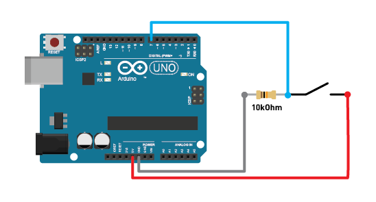
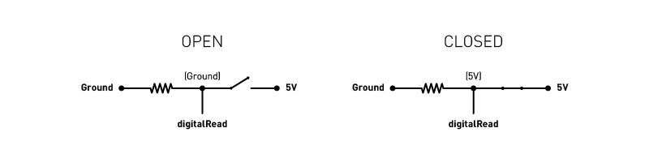

# Electronics As Material

Class materials for the Electronics As Material section in Design Fundamentals (NUS DID Year 1). 

Here, you will find information on how to build different sensors.

 
 
 

## Contents
1. [Arduinos, Inputs, Logic Levels](#logic)
1. [Button](#button)
1. [Pressure Sensor](#pressure)
1. [Bend Sensor](#bend)
1. [Touch Sensor](#touch)

 
 
 

## <a id="logic">Microcontrollers, Inputs, Logic Levels</a>
A microcontroller (such as the Arduino Uno) is a digital electronic device that 'thinks' in binary states: 1/0, On/Off, High/Low. Each microcontroller has certain set of logic level thresholds it operates within, usually defined in terms of voltages.

| | | |
|---|---|---|
| Pinout diagram for Arduino Uno R3 | | image from Arduino.cc |
| | | |

 

This matters as it affects how read the input pins on a microcontroller. In the Arduino programming environment, this is achieved with the `digitalRead(INPUT_PIN_NUMBER)` function.

To use an (over)simplified example, the Arduino Uno R3 operates on 5V logic. When more than 2V is supplied to an input pin, the `digitalRead(INPUT_PIN_NUMBER)` reading will be `HIGH/1`. When less than 0.8V is supplied to an input pin, the `digitalRead(INPUT_PIN_NUMBER)` reading will be `LOW/0`. (See figure above)

 

Sometimes however, On and Off is not good enough for our purposes; for instance, when you want to find out the amount of force exerted on a button. In this case, we need measure an analog value; one that is between `HIGH` and `LOW`. However, remember that microcontrollers are still digital devices. To achieve a more continuous logic/voltage reading, the microcontroller converts these analog readings into digital signals through an ADC (Analog to Digital Converter). 

A microcontroller might have a number of input pins connected to ADC for you to use; such as pins `A0` to `A5` on the Arduino Uno R3. In the Arduino programming environment, you can read analog inputs with the `analogRead(INPUT_PIN_NUMBER)` function.

The ADC breaks down a logic level into smaller steps depending on its resolution (measured in bits). For instance, a 10-bit ADC breaks down a logic level to 1024 steps (2 to the power of 10). The Arduino Uno R3 provides 10-bit ADCs operating on a 5V logic level. (See figure above)

e.g. 
| input voltage | `analogRead` value |
|---|---|
| 0.0V | 0 |
| 5.0V | 1023 |
| 2.5V | 512 |

 
 

For a more detailed explanation, do refer to this [Sparkfun's article on logic levels](https://learn.sparkfun.com/tutorials/logic-levels/) and also [their article on analog to digital conversions](https://learn.sparkfun.com/tutorials/analog-to-digital-conversion/all).

 
 
 

## <a id="button">Button</a>
A button in its simplest form is an input that provides an `on` or `off` state, usually by closing or opening an electrical circuit. To read a button with a microcontroller, we need to construct a circuit connected to a digital pin that can toggle between `HIGH/1` and `LOW/0` depending on the interaction with the button.

### Button with pull-down resistor

 

We use the diagram on the right to create our button circuit.

 

This circuit follows the following schematic. Essentially, when the button is open, the resistor "pulls down" the digital pin value to `Ground`, and it reads `LOW/0`. (That is why it is called a pull-down resistor.) When the button is closed, the level at the digital pin is `5V` and it reads `HIGH/1`.

Use the following [example code](code/buttonRead.ino) to read this circuit. The digital pin used in this example is `7`.

 
 
 

## <a id="pressure">Pressure Sensor</a>

 
 
 

## <a id="bend">Bend Sensor</a>

 
 
 

## <a id="touch">Touch Sensor</a>

 
 
 