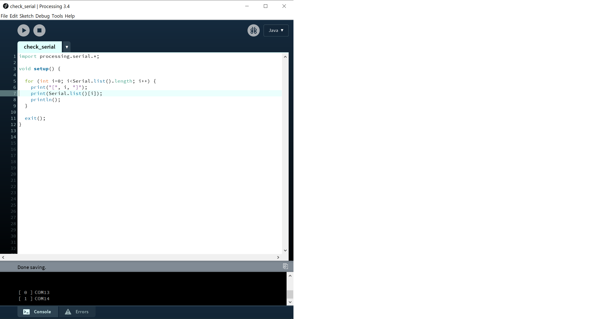

# Controlling Snake with an Arduino Controller

This folder contains two versions of the classic game "Snake" written in Processing 3.

<br>

## Snake Standalone

Processing code: [Snake_Standalone](Snake_Standalone)

Play Snake with the keyboard:
| key | action |
|---|---|
| `w` | up |
| `a` | left |
| `s` | down |
| `d` | right |
| `r` | reset |
| `o` | speed down |
| `p` | speed up | 

<br>

## Snake Serial

Processing code: [Snake_Serial](Snake_Serial)

This Processing sketch listens for commands coming over the serial port connected to the Arduino controller. First, look at `line 3` of the code:

```
int serial_port_index = 0;
```

To figure out which Serial port Processing should be listening to, open the run the following [Processing sketch](check_serial).



Check the print out in the black rectangle at the bottom of the processing IDE. You should see a series of lines, starting with `[ 0 ]` with the different ports your computer has. Find out with port Arduino uses. (Still not sure which is the Arduino? Check the serial port list in the Arduino IDE. Or, unplug the Arduino and run the Processing sketch and see which port disappears).

Change the value of `serial_port_index` in the `Snake_Serial.pde` file to match the port number corresponding to the Arduino.

The Arduino microcontroller controls the Snake game in Processing by sending text commands over the serial port, with the `Serial.println("text command")` function. List of text commands:

| text command | action |
|---|---|
| `"1"` | up |
| `"2"` | left |
| `"3"` | down |
| `"4"` | right |
| `"5"` | reset |
| `"6"` | speed down |
| `"7"` | speed up | 

Here is an [example Arduino code](Snake_ArduinoExample) that listens to the state of 5 push buttons and sends a different text command over serial depending on which button is pressed.